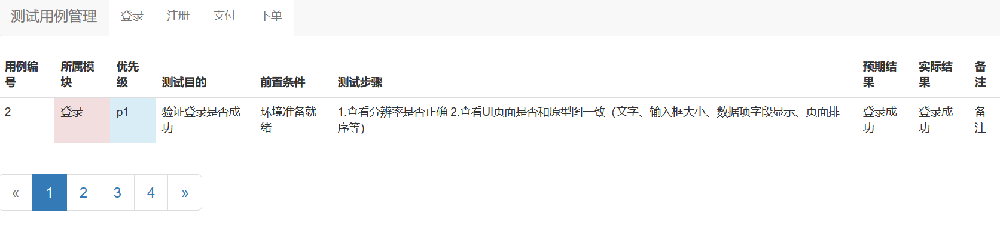

## 访问首页
http://127.0.0.1:8000/CaseManagement/
### 建议先执行迁移命令：
python manage.py  makemigrations

python manage.py  migrate

## 后台管理员
python manage.py  createsuperuser

用户名：admin 密码 1qaz2wsx 

## 问题解答
加博主微信

## 后续更新
请关注微信公众号：测试开发实战课

## 更新计划
欢迎其他同学一块参与

## 关注其它博主微信公众号

测试开发干货

测试开发水货

测试开发坑货

测试开发杂货

测试开发鲜货

测试开发实战课

